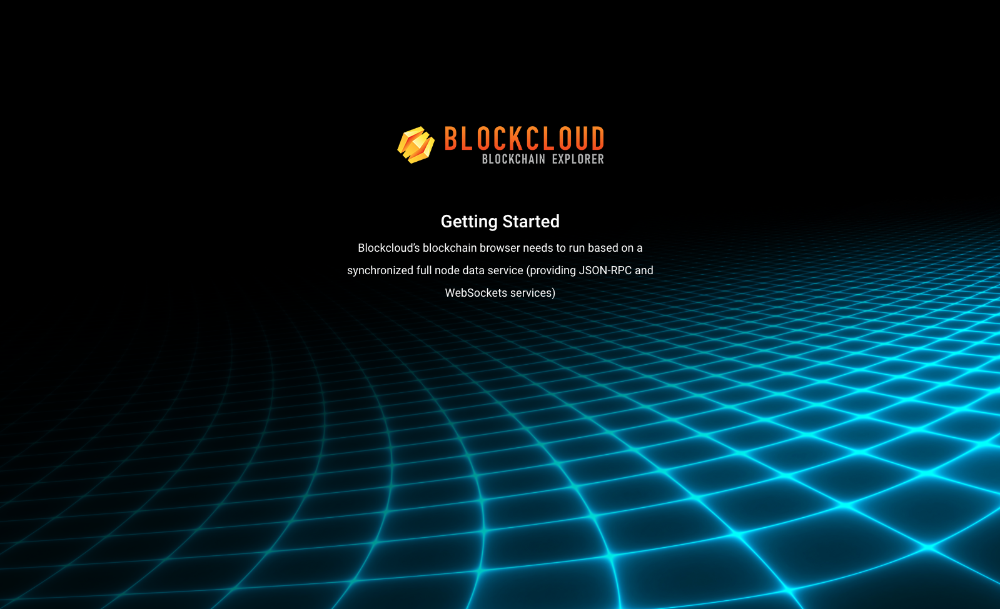
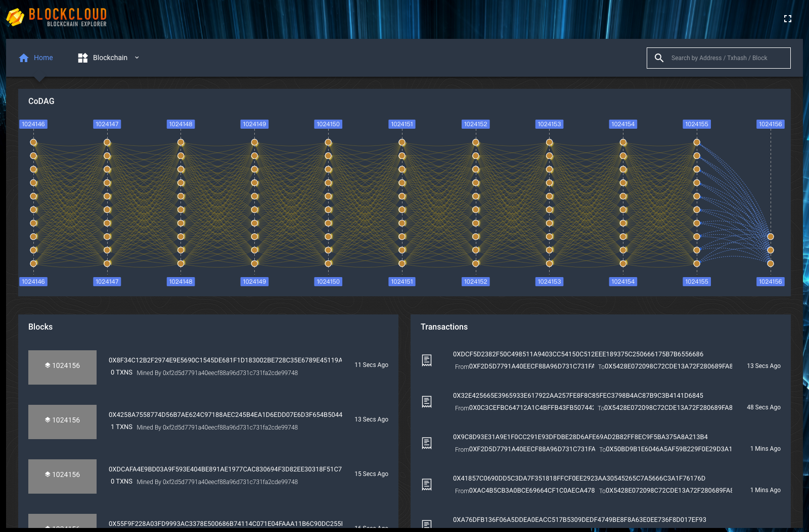
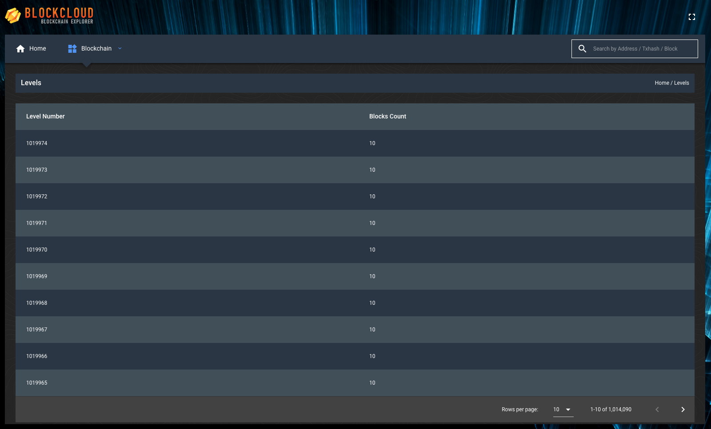
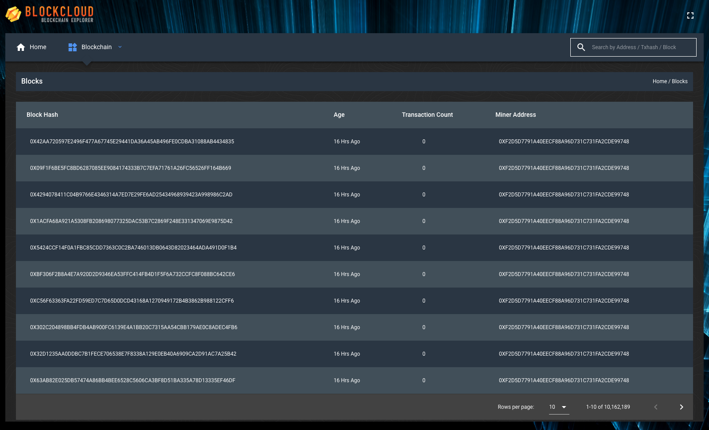
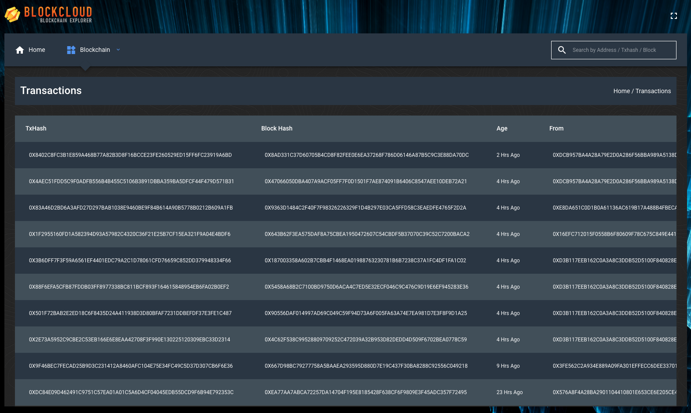
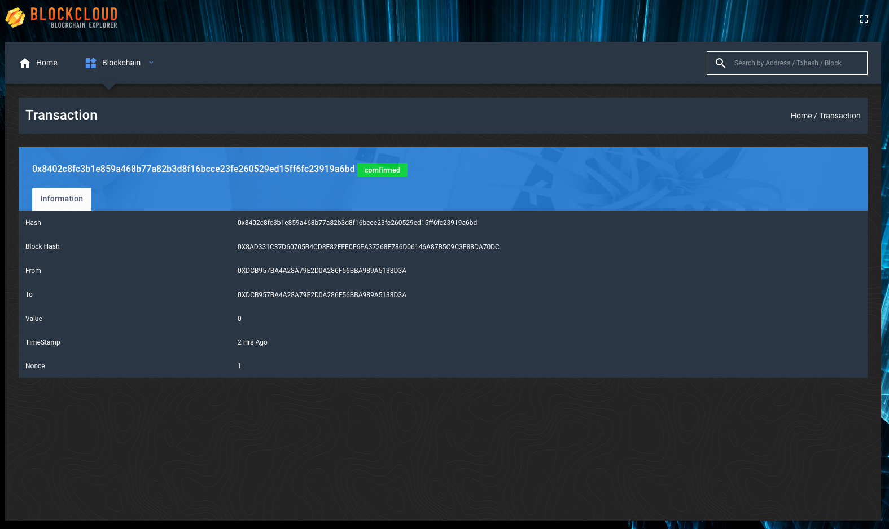
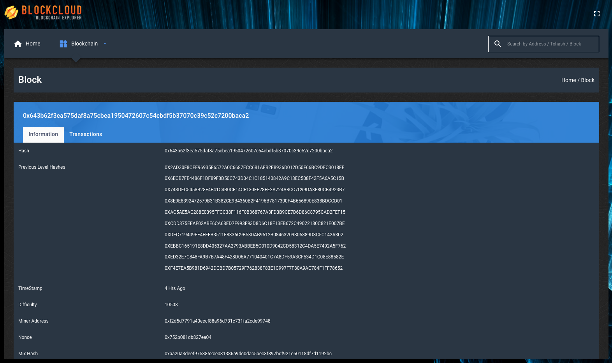

# bloc-explorer-alpha

This is Blockcloud’s blockchain browser based on the Blockcloud Api Service project.

## Blockcloud Api Service

This is merely a backend service, which tracks and synchronizes full node data of Blockcloud’s blockchain, and provides JSON-RPC and WebSockets services.

## Getting started

### Installation

1. **Install Node.js and NPM**: Download Node.js Recommended Version from the official website https://nodejs.org/en/download/ and install it on your system. NPM comes bundled with Node.js

2. **Install npm packages** : Open terminal , go to project root directory and run `npm install`, it will download all the dependencies under node_modules folder. Please wait for it to finish.

### Running Development Server

run `npm run serve`, wait for it to finish and once it finishes access http://localhost:8089/ to run Blockcloud Blockchain Explorer on browser. The app will automatically reload if you make any changes in any of the source file.

If it cannot be started, try the following command:`npm rebuild node-sass`

### Building:

run `npm run build`, to build the Blockcloud Blockchain Explorer and wait for it to finish. The build will be stored in the `dist/` directory.

## Configuration

Configure the Blockcloud Blockchain Explorer modifying [config/index.js](/src/config/index.js). add a Blockcloud JSON-RPC host and WebSockets host.

```
// blockcloud blockchain api service config
export default {
    api: "", //Blockcloud JSON-RPC Api
    ws_api: "" //Blockcloud WebSockets Api
};
```

## Blockcloud Blockchain Explorer Ui

### running(no Blockcloud Intelligence Service host)



### running(add a Blockcloud Intelligence Service)

The latest 10-layer CODAG structure rendering, and new attached rendering of CODAG layer, and the latest generated block and transaction can be seen.



### Levels

All data from CODAG layer of Blockcloud’s blockchain



### Blocks

All the block data from Blockcloud’s blockchain



### Transactions

All the transaction records from Blockcloud’s blockchain



### Transaction Details



### Block Details


